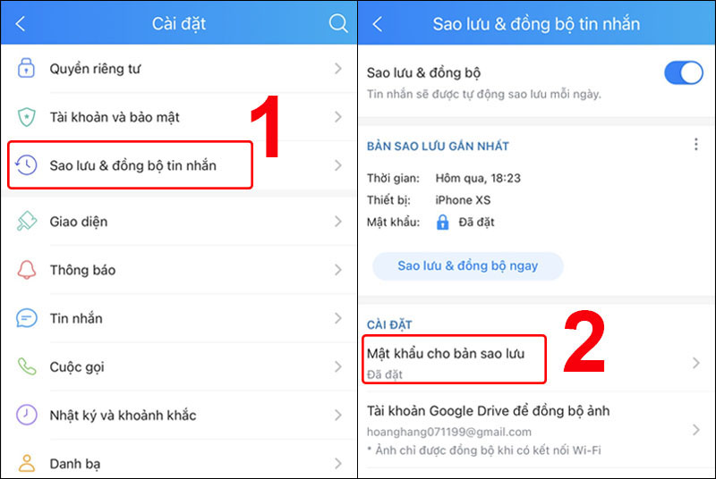
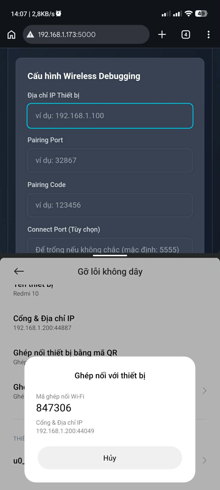
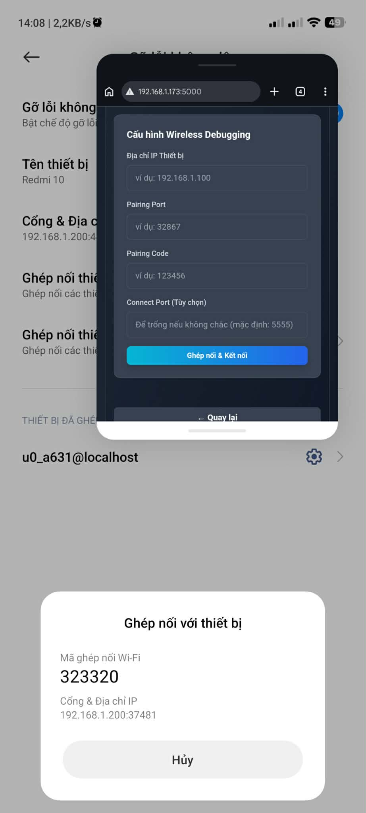

# Zalo Data Transfer Tool (Phiên bản đơn giản hóa)

Tool này cho phép bạn chuyển dữ liệu Zalo (`/sdcard/Android/data/com.zing.zalo/files`) giữa hai thiết bị Android, hoặc giữa PC và Android một cách an toàn thông qua ADB.

**Kiến trúc:**
*   **Backend & Frontend:** Một ứng dụng Python (Flask) duy nhất, vừa cung cấp API điều khiển ADB, vừa phục vụ giao diện người dùng.

---

## Trước khi bắt đầu

**QUAN TRỌNG:** Trước khi sử dụng tool, bạn cần sao lưu tin nhắn Zalo để đảm bảo không mất dữ liệu nào.

1.  Trong Zalo, vào **Cài đặt** > **Sao lưu & đồng bộ tin nhắn**.
2.  Bật **Sao lưu & đồng bộ**.
3.  Bạn nên đặt mật khẩu cho bản sao lưu của mình.



---

## Yêu cầu Hệ thống

### Chung
*   Đã bật **Tùy chọn nhà phát triển (Developer Options)** và **Gỡ lỗi USB (USB Debugging)** (hoặc **Gỡ lỗi không dây (Wireless Debugging)**) trên các thiết bị Android.
*   Kiến thức cơ bản về dòng lệnh.

### Cho Windows
*   **Python 3.8+**: [Tải về tại đây](https://www.python.org/downloads/windows/). Nhớ chọn "Add Python to PATH" khi cài đặt.
*   **Android SDK Platform-Tools (ADB)**: [Tải về tại đây](https://developer.android.com/studio/releases/platform-tools). Giải nén và thêm đường dẫn của thư mục `platform-tools` vào biến môi trường `PATH` của hệ thống.

### Cho Android (Termux)
*   Ứng dụng **Termux** từ F-Droid.
*   Cài đặt các gói cần thiết trong Termux:
    ```bash
    pkg update && pkg upgrade
    pkg install python android-tools # android-tools cung cấp lệnh adb
    ```

---

## Cài đặt và Chạy

### 1. Cài đặt Nhanh (Khuyến khích)

Sau khi đã clone hoặc tải về project, bạn có thể sử dụng các script cài đặt nhanh sau:

*   **Trên Android (Termux):**
    ```bash
    chmod +x install_android.sh
    ./install_android.sh
    ```
*   **Trên Windows:**
    ```cmd
    install_windows.bat
    ```
Các script này sẽ tự động cài đặt các thư viện Python cần thiết.

### 2. Chạy Ứng dụng

Sau khi cài đặt xong, bạn chỉ cần ở trong thư mục `zalo_data_transfer` và chạy lệnh sau để khởi động công cụ:

```bash
python run.py
```

### 3. Mở Giao diện

Mở trình duyệt web và truy cập vào địa chỉ: `http://127.0.0.1:5000`

---

## Hướng dẫn Sử dụng Giao diện

Giao diện của tool được thiết kế theo dạng wizard từng bước:

1.  **Bước 1: Chọn Môi trường:** Chọn xem bạn đang chạy tool này trên `Windows` hay `Android (Termux)`.
2.  **Bước 2: Chọn Hướng Dữ liệu:**
    *   **Xuất (Export):** Lấy dữ liệu từ máy đang chạy tool (Máy A) sang máy kia (Máy B).
    *   **Nhập (Import):** Lấy dữ liệu từ máy kia (Máy B) vào máy đang chạy tool (Máy A).
3.  **Bước 3: Kết nối Thiết bị:**
    *   **USB:** Kết nối thiết bị qua cáp USB và đảm bảo đã bật Gỡ lỗi USB. Tool sẽ tự động kiểm tra. Để biết hướng dẫn chi tiết, xem: [Cách kết nối ADB qua USB](https://developer.android.com/studio/command-line/adb#connect-to-a-device-over-usb)
    *   **Gỡ lỗi không dây (Wireless Debugging):** Bật Gỡ lỗi không dây trên thiết bị Android đích, sau đó nhập IP, Cổng ghép nối (Pairing Port), và Mã ghép nối (Pairing Code) hiển thị trên màn hình điện thoại. Để biết hướng dẫn chi tiết, xem: [Cách kết nối ADB qua Wi-Fi](https://developer.android.com/studio/command-line/adb#connect-to-a-device-over-wi-fi)
4.  **Bước 4: Bắt đầu:**
    *   Kiểm tra lại thông tin tóm tắt.
    *   Nhấn nút **Bắt đầu** để thực hiện quá trình chuyển dữ liệu.
    *   Theo dõi thanh tiến trình và log hiển thị thời gian thực.

---

## Lưu ý đặc biệt cho Android 11+ (Chuyển giữa 2 máy Android)

Do chính sách bảo mật của Android 11 trở lên, thư mục `/sdcard/Android/data` bị hạn chế quyền truy cập. Khi chạy tool trên Termux để chuyển dữ liệu giữa 2 máy Android (A và B), bạn **bắt buộc phải kết nối ADB tới cả hai máy**, bao gồm cả máy A đang chạy tool.

**Mục đích:** Tool cần quyền ADB trên chính máy A để có thể đọc/ghi dữ liệu vào thư mục Zalo được bảo vệ.

**Cách thực hiện trên máy A (máy chạy tool):**

1.  Bật **Gỡ lỗi không dây (Wireless Debugging)** trên máy A.
2.  Mở giao diện web của tool (`http://127.0.0.1:5000`) trên trình duyệt.
3.  Sử dụng tính năng **Chia đôi màn hình (Split Screen)** hoặc **Cửa sổ nổi (Floating Window)** của Android để hiển thị song song trình duyệt và màn hình Gỡ lỗi không dây. Điều này giúp bạn có thể xem mã ghép nối và nhập vào giao diện tool một cách dễ dàng.
4.  Trong giao diện tool, chọn kết nối tới thiết bị A trước, nhập thông tin IP, cổng và mã ghép nối.
5.  Sau khi kết nối thành công với máy A, tool sẽ yêu cầu kết nối với máy B. Bạn thực hiện tương tự.

**Minh họa:**

*   **Chế độ Chia đôi màn hình (Split Screen):**
    Bạn có thể chia đôi màn hình để hiển thị trình duyệt và màn hình Gỡ lỗi không dây cùng lúc.
    

*   **Chế độ Cửa sổ nổi (Floating Window/Popup):**
    Hoặc sử dụng chế độ cửa sổ nổi để màn hình Gỡ lỗi không dây hiển thị dưới dạng một cửa sổ nhỏ trên trình duyệt.
    

---

## Cảnh báo An toàn

*   Tool này chỉ thao tác với dữ liệu trên thiết bị của bạn thông qua ADB và không gửi bất kỳ thông tin nào lên Internet.
*   Thao tác **Nhập dữ liệu (Import)** sẽ **GHI ĐÈ** thư mục Zalo trên thiết bị đích. Luôn sao lưu dữ liệu quan trọng trước khi thực hiện.
*   Nhà phát triển không chịu trách nhiệm cho bất kỳ mất mát dữ liệu nào. Hãy sử dụng một cách cẩn trọng.
